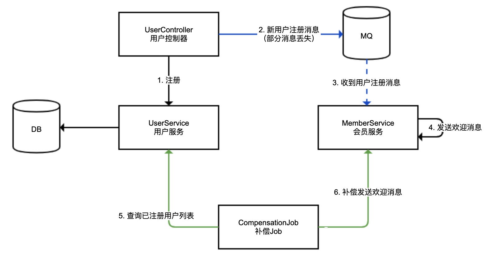
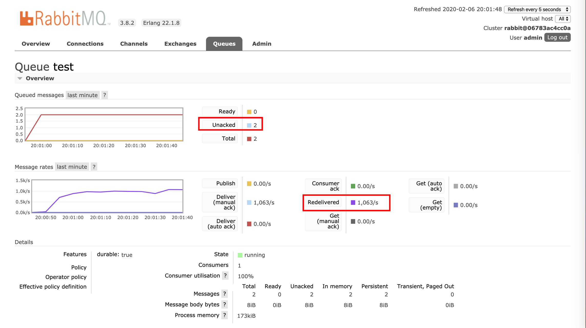
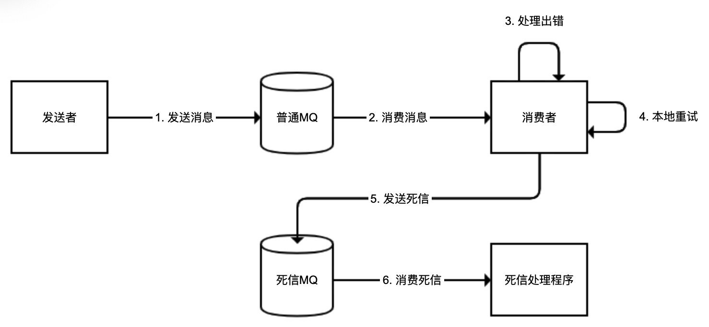

# 25 | 异步处理好用，但非常容易用错
你好，我是朱晔。今天，我来和你聊聊好用但容易出错的异步处理。

异步处理是互联网应用不可或缺的一种架构模式，大多数业务项目都是由同步处理、异步处理和定时任务处理三种模式相辅相成实现的。

区别于同步处理，异步处理无需同步等待流程处理完毕，因此适用场景主要包括：

- 服务于主流程的分支流程。比如，在注册流程中，把数据写入数据库的操作是主流程，但注册后给用户发优惠券或欢迎短信的操作是分支流程，时效性不那么强，可以进行异步处理。
- 用户不需要实时看到结果的流程。比如，下单后的配货、送货流程完全可以进行异步处理，每个阶段处理完成后，再给用户发推送或短信让用户知晓即可。

同时，异步处理因为可以有MQ中间件的介入用于任务的缓冲的分发，所以相比于同步处理，在应对流量洪峰、实现模块解耦和消息广播方面有功能优势。

不过，异步处理虽然好用，但在实现的时候却有三个最容易犯的错，分别是异步处理流程的可靠性问题、消息发送模式的区分问题，以及大量死信消息堵塞队列的问题。今天，我就用三个代码案例结合目前常用的MQ系统RabbitMQ，来和你具体聊聊。

今天这一讲的演示，我都会使用Spring AMQP来操作RabbitMQ，所以你需要先引入amqp依赖：

```
<dependency>
    <groupId>org.springframework.boot</groupId>
    <artifactId>spring-boot-starter-amqp</artifactId>
</dependency>

```

## 异步处理需要消息补偿闭环

使用类似RabbitMQ、RocketMQ等MQ系统来做消息队列实现异步处理，虽然说消息可以落地到磁盘保存，即使MQ出现问题消息数据也不会丢失，但是异步流程在消息发送、传输、处理等环节，都可能发生消息丢失。此外，任何MQ中间件都无法确保100%可用，需要考虑不可用时异步流程如何继续进行。

因此， **对于异步处理流程，必须考虑补偿或者说建立主备双活流程**。

我们来看一个用户注册后异步发送欢迎消息的场景。用户注册落数据库的流程为同步流程，会员服务收到消息后发送欢迎消息的流程为异步流程。



我们来分析一下：

- 蓝色的线，使用MQ进行的异步处理，我们称作主线，可能存在消息丢失的情况（虚线代表异步调用）；
- 绿色的线，使用补偿Job定期进行消息补偿，我们称作备线，用来补偿主线丢失的消息；
- 考虑到极端的MQ中间件失效的情况，我们要求备线的处理吞吐能力达到主线的能力水平。

我们来看一下相关的实现代码。

首先，定义UserController用于注册+发送异步消息。对于注册方法，我们一次性注册10个用户，用户注册消息不能发送出去的概率为50%。

```
@RestController
@Slf4j
@RequestMapping("user")
public class UserController {
    @Autowired
    private UserService userService;
    @Autowired
    private RabbitTemplate rabbitTemplate;

    @GetMapping("register")
    public void register() {
        //模拟10个用户注册
        IntStream.rangeClosed(1, 10).forEach(i -> {
            //落库
            User user = userService.register();
            //模拟50%的消息可能发送失败
            if (ThreadLocalRandom.current().nextInt(10) % 2 == 0) {
                //通过RabbitMQ发送消息
               rabbitTemplate.convertAndSend(RabbitConfiguration.EXCHANGE, RabbitConfiguration.ROUTING_KEY, user);
                log.info("sent mq user {}", user.getId());
            }
        });
    }
}

```

然后，定义MemberService类用于模拟会员服务。会员服务监听用户注册成功的消息，并发送欢迎短信。我们使用ConcurrentHashMap来存放那些发过短信的用户ID实现幂等，避免相同的用户进行补偿时重复发送短信：

```
@Component
@Slf4j
public class MemberService {
    //发送欢迎消息的状态
    private Map<Long, Boolean> welcomeStatus = new ConcurrentHashMap<>();
    //监听用户注册成功的消息，发送欢迎消息
    @RabbitListener(queues = RabbitConfiguration.QUEUE)
    public void listen(User user) {
        log.info("receive mq user {}", user.getId());
        welcome(user);
    }
    //发送欢迎消息
    public void welcome(User user) {
        //去重操作
        if (welcomeStatus.putIfAbsent(user.getId(), true) == null) {
            try {
                TimeUnit.SECONDS.sleep(2);
            } catch (InterruptedException e) {
            }
            log.info("memberService: welcome new user {}", user.getId());
        }
    }
}

```

对于MQ消费程序，处理逻辑务必考虑去重（支持幂等），原因有几个：

- MQ消息可能会因为中间件本身配置错误、稳定性等原因出现重复。
- 自动补偿重复，比如本例，同一条消息可能既走MQ也走补偿，肯定会出现重复，而且考虑到高内聚，补偿Job本身不会做去重处理。
- 人工补偿重复。出现消息堆积时，异步处理流程必然会延迟。如果我们提供了通过后台进行补偿的功能，那么在处理遇到延迟的时候，很可能会先进行人工补偿，过了一段时间后处理程序又收到消息了，重复处理。我之前就遇到过一次由MQ故障引发的事故，MQ中堆积了几十万条发放资金的消息，导致业务无法及时处理，运营以为程序出错了就先通过后台进行了人工处理，结果MQ系统恢复后消息又被重复处理了一次，造成大量资金重复发放。

接下来，定义补偿Job也就是备线操作。

我们在CompensationJob中定义一个@Scheduled定时任务，5秒做一次补偿操作，因为Job并不知道哪些用户注册的消息可能丢失，所以是全量补偿，补偿逻辑是：每5秒补偿一次，按顺序一次补偿5个用户，下一次补偿操作从上一次补偿的最后一个用户ID开始；对于补偿任务我们提交到线程池进行“异步”处理，提高处理能力。

```
@Component
@Slf4j
public class CompensationJob {
    //补偿Job异步处理线程池
    private static ThreadPoolExecutor compensationThreadPool = new ThreadPoolExecutor(
            10, 10,
            1, TimeUnit.HOURS,
            new ArrayBlockingQueue<>(1000),
            new ThreadFactoryBuilder().setNameFormat("compensation-threadpool-%d").get());
    @Autowired
    private UserService userService;
    @Autowired
    private MemberService memberService;
    //目前补偿到哪个用户ID
    private long offset = 0;

    //10秒后开始补偿，5秒补偿一次
    @Scheduled(initialDelay = 10_000, fixedRate = 5_000)
    public void compensationJob() {
        log.info("开始从用户ID {} 补偿", offset);
        //获取从offset开始的用户
        userService.getUsersAfterIdWithLimit(offset, 5).forEach(user -> {
            compensationThreadPool.execute(() -> memberService.welcome(user));
            offset = user.getId();
        });
    }
}

```

为了实现高内聚，主线和备线处理消息，最好使用同一个方法。比如，本例中MemberService监听到MQ消息和CompensationJob补偿，调用的都是welcome方法。

此外值得一说的是，Demo中的补偿逻辑比较简单，生产级的代码应该在以下几个方面进行加强：

- 考虑配置补偿的频次、每次处理数量，以及补偿线程池大小等参数为合适的值，以满足补偿的吞吐量。
- 考虑备线补偿数据进行适当延迟。比如，对注册时间在30秒之前的用户再进行补偿，以方便和主线MQ实时流程错开，避免冲突。
- 诸如当前补偿到哪个用户的offset数据，需要落地数据库。
- 补偿Job本身需要高可用，可以使用类似XXLJob或ElasticJob等任务系统。

运行程序，执行注册方法注册10个用户，输出如下：

```
[17:01:16.570] [http-nio-45678-exec-1] [INFO ] [o.g.t.c.a.compensation.UserController:28  ] - sent mq user 1
[17:01:16.571] [http-nio-45678-exec-1] [INFO ] [o.g.t.c.a.compensation.UserController:28  ] - sent mq user 5
[17:01:16.572] [http-nio-45678-exec-1] [INFO ] [o.g.t.c.a.compensation.UserController:28  ] - sent mq user 7
[17:01:16.573] [http-nio-45678-exec-1] [INFO ] [o.g.t.c.a.compensation.UserController:28  ] - sent mq user 8
[17:01:16.594] [org.springframework.amqp.rabbit.RabbitListenerEndpointContainer#0-1] [INFO ] [o.g.t.c.a.compensation.MemberService:18  ] - receive mq user 1
[17:01:18.597] [org.springframework.amqp.rabbit.RabbitListenerEndpointContainer#0-1] [INFO ] [o.g.t.c.a.compensation.MemberService:28  ] - memberService: welcome new user 1
[17:01:18.601] [org.springframework.amqp.rabbit.RabbitListenerEndpointContainer#0-1] [INFO ] [o.g.t.c.a.compensation.MemberService:18  ] - receive mq user 5
[17:01:20.603] [org.springframework.amqp.rabbit.RabbitListenerEndpointContainer#0-1] [INFO ] [o.g.t.c.a.compensation.MemberService:28  ] - memberService: welcome new user 5
[17:01:20.604] [org.springframework.amqp.rabbit.RabbitListenerEndpointContainer#0-1] [INFO ] [o.g.t.c.a.compensation.MemberService:18  ] - receive mq user 7
[17:01:22.605] [org.springframework.amqp.rabbit.RabbitListenerEndpointContainer#0-1] [INFO ] [o.g.t.c.a.compensation.MemberService:28  ] - memberService: welcome new user 7
[17:01:22.606] [org.springframework.amqp.rabbit.RabbitListenerEndpointContainer#0-1] [INFO ] [o.g.t.c.a.compensation.MemberService:18  ] - receive mq user 8
[17:01:24.611] [org.springframework.amqp.rabbit.RabbitListenerEndpointContainer#0-1] [INFO ] [o.g.t.c.a.compensation.MemberService:28  ] - memberService: welcome new user 8
[17:01:25.498] [scheduling-1] [INFO ] [o.g.t.c.a.compensation.CompensationJob:29  ] - 开始从用户ID 0 补偿
[17:01:27.510] [compensation-threadpool-1] [INFO ] [o.g.t.c.a.compensation.MemberService:28  ] - memberService: welcome new user 2
[17:01:27.510] [compensation-threadpool-3] [INFO ] [o.g.t.c.a.compensation.MemberService:28  ] - memberService: welcome new user 4
[17:01:27.511] [compensation-threadpool-2] [INFO ] [o.g.t.c.a.compensation.MemberService:28  ] - memberService: welcome new user 3
[17:01:30.496] [scheduling-1] [INFO ] [o.g.t.c.a.compensation.CompensationJob:29  ] - 开始从用户ID 5 补偿
[17:01:32.500] [compensation-threadpool-6] [INFO ] [o.g.t.c.a.compensation.MemberService:28  ] - memberService: welcome new user 6
[17:01:32.500] [compensation-threadpool-9] [INFO ] [o.g.t.c.a.compensation.MemberService:28  ] - memberService: welcome new user 9
[17:01:35.496] [scheduling-1] [INFO ] [o.g.t.c.a.compensation.CompensationJob:29  ] - 开始从用户ID 9 补偿
[17:01:37.501] [compensation-threadpool-0] [INFO ] [o.g.t.c.a.compensation.MemberService:28  ] - memberService: welcome new user 10
[17:01:40.495] [scheduling-1] [INFO ] [o.g.t.c.a.compensation.CompensationJob:29  ] - 开始从用户ID 10 补偿

```

可以看到：

- 总共10个用户，MQ发送成功的用户有四个，分别是用户1、5、7、8。
- 补偿任务第一次运行，补偿了用户2、3、4，第二次运行补偿了用户6、9，第三次运行补充了用户10。

最后提一下，针对消息的补偿闭环处理的最高标准是，能够达到补偿全量数据的吞吐量。也就是说，如果补偿备线足够完善，即使直接把MQ停机，虽然会略微影响处理的及时性，但至少确保流程都能正常执行。

## 注意消息模式是广播还是工作队列

在今天这一讲的一开始，我们提到异步处理的一个重要优势，是实现消息广播。

消息广播，和我们平时说的“广播”意思差不多，就是希望同一条消息，不同消费者都能分别消费；而队列模式，就是不同消费者共享消费同一个队列的数据，相同消息只能被某一个消费者消费一次。

比如，同一个用户的注册消息，会员服务需要监听以发送欢迎短信，营销服务同样需要监听以发送新用户小礼物。但是，会员服务、营销服务都可能有多个实例，我们期望的是同一个用户的消息，可以同时广播给不同的服务（广播模式），但对于同一个服务的不同实例（比如会员服务1和会员服务2），不管哪个实例来处理，处理一次即可（工作队列模式）：


在实现代码的时候，我们务必确认MQ系统的机制，确保消息的路由按照我们的期望。

对于类似RocketMQ这样的MQ来说，实现类似功能比较简单直白：如果消费者属于一个组，那么消息只会由同一个组的一个消费者来消费；如果消费者属于不同组，那么每个组都能消费一遍消息。

而对于RabbitMQ来说，消息路由的模式采用的是队列+交换器，队列是消息的载体，交换器决定了消息路由到队列的方式，配置比较复杂，容易出错。所以，接下来我重点和你讲讲RabbitMQ的相关代码实现。

我们还是以上面的架构图为例，来演示使用RabbitMQ实现广播模式和工作队列模式的坑。

**第一步，实现会员服务监听用户服务发出的新用户注册消息的那部分逻辑。**

如果我们启动两个会员服务，那么同一个用户的注册消息应该只能被其中一个实例消费。

我们分别实现RabbitMQ队列、交换器、绑定三件套。其中，队列用的是匿名队列，交换器用的是直接交换器DirectExchange，交换器绑定到匿名队列的路由Key是空字符串。在收到消息之后，我们会打印所在实例使用的端口：

```
//为了代码简洁直观，我们把消息发布者、消费者、以及MQ的配置代码都放在了一起
@Slf4j
@Configuration
@RestController
@RequestMapping("workqueuewrong")
public class WorkQueueWrong {

    private static final String EXCHANGE = "newuserExchange";
    @Autowired
    private RabbitTemplate rabbitTemplate;

    @GetMapping
    public void sendMessage() {
        rabbitTemplate.convertAndSend(EXCHANGE, "", UUID.randomUUID().toString());
    }

    //使用匿名队列作为消息队列
    @Bean
    public Queue queue() {
        return new AnonymousQueue();
    }

    //声明DirectExchange交换器，绑定队列到交换器
    @Bean
    public Declarables declarables() {
        DirectExchange exchange = new DirectExchange(EXCHANGE);
        return new Declarables(queue(), exchange,
                BindingBuilder.bind(queue()).to(exchange).with(""));
    }

    //监听队列，队列名称直接通过SpEL表达式引用Bean
    @RabbitListener(queues = "#{queue.name}")
    public void memberService(String userName) {
        log.info("memberService: welcome message sent to new user {} from {}", userName, System.getProperty("server.port"));

    }
}

```

使用12345和45678两个端口启动两个程序实例后，调用sendMessage接口发送一条消息，输出的日志，显示 **同一个会员服务两个实例都收到了消息**：


**出现这个问题的原因是，我们没有理清楚RabbitMQ直接交换器和队列的绑定关系。**

如下图所示，RabbitMQ的直接交换器根据routingKey对消息进行路由。由于我们的程序每次启动都会创建匿名（随机命名）的队列，所以相当于每一个会员服务实例都对应独立的队列，以空routingKey绑定到直接交换器。用户服务发出消息的时候也设置了routingKey为空，所以直接交换器收到消息之后，发现有两条队列匹配，于是都转发了消息：


要修复这个问题其实很简单，对于会员服务不要使用匿名队列，而是使用同一个队列即可。把上面代码中的匿名队列替换为一个普通队列：

```
private static final String QUEUE = "newuserQueue";
@Bean
public Queue queue() {
    return new Queue(QUEUE);
}

```

测试发现，对于同一条消息来说，两个实例中只有一个实例可以收到，不同的消息按照轮询分发给不同的实例。现在，交换器和队列的关系是这样的：


**第二步，进一步完整实现用户服务需要广播消息给会员服务和营销服务的逻辑。**

我们希望会员服务和营销服务都可以收到广播消息，但会员服务或营销服务中的每个实例只需要收到一次消息。

代码如下，我们声明了一个队列和一个广播交换器FanoutExchange，然后模拟两个用户服务和两个营销服务：

```
@Slf4j
@Configuration
@RestController
@RequestMapping("fanoutwrong")
public class FanoutQueueWrong {
    private static final String QUEUE = "newuser";
    private static final String EXCHANGE = "newuser";
    @Autowired
    private RabbitTemplate rabbitTemplate;

    @GetMapping
    public void sendMessage() {
        rabbitTemplate.convertAndSend(EXCHANGE, "", UUID.randomUUID().toString());
    }
    //声明FanoutExchange，然后绑定到队列，FanoutExchange绑定队列的时候不需要routingKey
    @Bean
    public Declarables declarables() {
        Queue queue = new Queue(QUEUE);
        FanoutExchange exchange = new FanoutExchange(EXCHANGE);
        return new Declarables(queue, exchange,
                BindingBuilder.bind(queue).to(exchange));
    }
    //会员服务实例1
    @RabbitListener(queues = QUEUE)
    public void memberService1(String userName) {
        log.info("memberService1: welcome message sent to new user {}", userName);

    }
    //会员服务实例2
    @RabbitListener(queues = QUEUE)
    public void memberService2(String userName) {
        log.info("memberService2: welcome message sent to new user {}", userName);

    }
    //营销服务实例1
    @RabbitListener(queues = QUEUE)
    public void promotionService1(String userName) {
        log.info("promotionService1: gift sent to new user {}", userName);
    }
    //营销服务实例2
    @RabbitListener(queues = QUEUE)
    public void promotionService2(String userName) {
        log.info("promotionService2: gift sent to new user {}", userName);
    }
}

```

我们请求四次sendMessage接口，注册四个用户。通过日志可以发现， **一条用户注册的消息，要么被会员服务收到，要么被营销服务收到，显然这不是广播**。那，我们使用的FanoutExchange，看名字就应该是实现广播的交换器，为什么根本没有起作用呢？


其实，广播交换器非常简单，它会忽略routingKey，广播消息到所有绑定的队列。在这个案例中，两个会员服务和两个营销服务都绑定了同一个队列，所以这四个服务只能收到一次消息：


修改方式很简单，我们把队列进行拆分，会员和营销两组服务分别使用一条独立队列绑定到广播交换器即可：

```
@Slf4j
@Configuration
@RestController
@RequestMapping("fanoutright")
public class FanoutQueueRight {
    private static final String MEMBER_QUEUE = "newusermember";
    private static final String PROMOTION_QUEUE = "newuserpromotion";
    private static final String EXCHANGE = "newuser";
    @Autowired
    private RabbitTemplate rabbitTemplate;
    @GetMapping
    public void sendMessage() {
        rabbitTemplate.convertAndSend(EXCHANGE, "", UUID.randomUUID().toString());
    }
    @Bean
    public Declarables declarables() {
        //会员服务队列
        Queue memberQueue = new Queue(MEMBER_QUEUE);
        //营销服务队列
        Queue promotionQueue = new Queue(PROMOTION_QUEUE);
        //广播交换器
        FanoutExchange exchange = new FanoutExchange(EXCHANGE);
        //两个队列绑定到同一个交换器
        return new Declarables(memberQueue, promotionQueue, exchange,
                BindingBuilder.bind(memberQueue).to(exchange),
                BindingBuilder.bind(promotionQueue).to(exchange));
    }
    @RabbitListener(queues = MEMBER_QUEUE)
    public void memberService1(String userName) {
        log.info("memberService1: welcome message sent to new user {}", userName);
    }
    @RabbitListener(queues = MEMBER_QUEUE)
    public void memberService2(String userName) {
        log.info("memberService2: welcome message sent to new user {}", userName);
    }
    @RabbitListener(queues = PROMOTION_QUEUE)
    public void promotionService1(String userName) {
        log.info("promotionService1: gift sent to new user {}", userName);
    }
    @RabbitListener(queues = PROMOTION_QUEUE)
    public void promotionService2(String userName) {
        log.info("promotionService2: gift sent to new user {}", userName);
    }
}

```

现在，交换器和队列的结构是这样的：


从日志输出可以验证，对于每一条MQ消息，会员服务和营销服务分别都会收到一次，一条消息广播到两个服务的同时，在每一个服务的两个实例中通过轮询接收：


所以说，理解了RabbitMQ直接交换器、广播交换器的工作方式之后，我们对消息的路由方式了解得很清晰了，实现代码就不会出错。

对于异步流程来说，消息路由模式一旦配置出错，轻则可能导致消息的重复处理，重则可能导致重要的服务无法接收到消息，最终造成业务逻辑错误。

每个MQ中间件对消息的路由处理的配置各不相同，我们一定要先了解原理再着手编码。

## 别让死信堵塞了消息队列

我们在介绍 [线程池](https://time.geekbang.org/column/article/210337) 的时候提到，如果线程池的任务队列没有上限，那么最终可能会导致OOM。使用消息队列处理异步流程的时候，我们也同样要注意消息队列的任务堆积问题。对于突发流量引起的消息队列堆积，问题并不大，适当调整消费者的消费能力应该就可以解决。 **但在很多时候，消息队列的堆积堵塞，是因为有大量始终无法处理的消息**。

比如，用户服务在用户注册后发出一条消息，会员服务监听到消息后给用户派发优惠券，但因为用户并没有保存成功，会员服务处理消息始终失败，消息重新进入队列，然后还是处理失败。这种在MQ中像幽灵一样回荡的同一条消息，就是死信。

随着MQ被越来越多的死信填满，消费者需要花费大量时间反复处理死信，导致正常消息的消费受阻， **最终MQ可能因为数据量过大而崩溃**。

我们来测试一下这个场景。首先，定义一个队列、一个直接交换器，然后把队列绑定到交换器：

```
@Bean
public Declarables declarables() {
    //队列
    Queue queue = new Queue(Consts.QUEUE);
    //交换器
    DirectExchange directExchange = new DirectExchange(Consts.EXCHANGE);
    //快速声明一组对象，包含队列、交换器，以及队列到交换器的绑定
    return new Declarables(queue, directExchange,
            BindingBuilder.bind(queue).to(directExchange).with(Consts.ROUTING_KEY));
}

```

然后，实现一个sendMessage方法来发送消息到MQ，访问一次提交一条消息，使用自增标识作为消息内容：

```
//自增消息标识
AtomicLong atomicLong = new AtomicLong();
@Autowired
private RabbitTemplate rabbitTemplate;

@GetMapping("sendMessage")
public void sendMessage() {
    String msg = "msg" + atomicLong.incrementAndGet();
    log.info("send message {}", msg);
    //发送消息
    rabbitTemplate.convertAndSend(Consts.EXCHANGE, msg);
}

```

收到消息后，直接抛出空指针异常，模拟处理出错的情况：

```
@RabbitListener(queues = Consts.QUEUE)
public void handler(String data) {
    log.info("got message {}", data);
    throw new NullPointerException("error");
}

```

调用sendMessage接口发送两条消息，然后来到RabbitMQ管理台，可以看到这两条消息始终在队列中，不断被重新投递，导致重新投递QPS达到了1063。



同时，在日志中可以看到大量异常信息：

```
[20:02:31.533] [org.springframework.amqp.rabbit.RabbitListenerEndpointContainer#0-1] [WARN ] [o.s.a.r.l.ConditionalRejectingErrorHandler:129 ] - Execution of Rabbit message listener failed.
org.springframework.amqp.rabbit.support.ListenerExecutionFailedException: Listener method 'public void org.geekbang.time.commonmistakes.asyncprocess.deadletter.MQListener.handler(java.lang.String)' threw exception
	at org.springframework.amqp.rabbit.listener.adapter.MessagingMessageListenerAdapter.invokeHandler(MessagingMessageListenerAdapter.java:219)
	at org.springframework.amqp.rabbit.listener.adapter.MessagingMessageListenerAdapter.invokeHandlerAndProcessResult(MessagingMessageListenerAdapter.java:143)
	at org.springframework.amqp.rabbit.listener.adapter.MessagingMessageListenerAdapter.onMessage(MessagingMessageListenerAdapter.java:132)
	at org.springframework.amqp.rabbit.listener.AbstractMessageListenerContainer.doInvokeListener(AbstractMessageListenerContainer.java:1569)
	at org.springframework.amqp.rabbit.listener.AbstractMessageListenerContainer.actualInvokeListener(AbstractMessageListenerContainer.java:1488)
	at org.springframework.amqp.rabbit.listener.AbstractMessageListenerContainer.invokeListener(AbstractMessageListenerContainer.java:1476)
	at org.springframework.amqp.rabbit.listener.AbstractMessageListenerContainer.doExecuteListener(AbstractMessageListenerContainer.java:1467)
	at org.springframework.amqp.rabbit.listener.AbstractMessageListenerContainer.executeListener(AbstractMessageListenerContainer.java:1411)
	at org.springframework.amqp.rabbit.listener.SimpleMessageListenerContainer.doReceiveAndExecute(SimpleMessageListenerContainer.java:958)
	at org.springframework.amqp.rabbit.listener.SimpleMessageListenerContainer.receiveAndExecute(SimpleMessageListenerContainer.java:908)
	at org.springframework.amqp.rabbit.listener.SimpleMessageListenerContainer.access$1600(SimpleMessageListenerContainer.java:81)
	at org.springframework.amqp.rabbit.listener.SimpleMessageListenerContainer$AsyncMessageProcessingConsumer.mainLoop(SimpleMessageListenerContainer.java:1279)
	at org.springframework.amqp.rabbit.listener.SimpleMessageListenerContainer$AsyncMessageProcessingConsumer.run(SimpleMessageListenerContainer.java:1185)
	at java.lang.Thread.run(Thread.java:748)
Caused by: java.lang.NullPointerException: error
	at org.geekbang.time.commonmistakes.asyncprocess.deadletter.MQListener.handler(MQListener.java:14)
	at sun.reflect.GeneratedMethodAccessor46.invoke(Unknown Source)
	at sun.reflect.DelegatingMethodAccessorImpl.invoke(DelegatingMethodAccessorImpl.java:43)
	at java.lang.reflect.Method.invoke(Method.java:498)
	at org.springframework.messaging.handler.invocation.InvocableHandlerMethod.doInvoke(InvocableHandlerMethod.java:171)
	at org.springframework.messaging.handler.invocation.InvocableHandlerMethod.invoke(InvocableHandlerMethod.java:120)
	at org.springframework.amqp.rabbit.listener.adapter.HandlerAdapter.invoke(HandlerAdapter.java:50)
	at org.springframework.amqp.rabbit.listener.adapter.MessagingMessageListenerAdapter.invokeHandler(MessagingMessageListenerAdapter.java:211)
	... 13 common frames omitted

```

解决死信无限重复进入队列最简单的方式是，在程序处理出错的时候，直接抛出AmqpRejectAndDontRequeueException异常，避免消息重新进入队列：

```
throw new AmqpRejectAndDontRequeueException("error");

```

但，我们更希望的逻辑是，对于同一条消息，能够先进行几次重试，解决因为网络问题导致的偶发消息处理失败，如果还是不行的话，再把消息投递到专门的一个死信队列。对于来自死信队列的数据，我们可能只是记录日志发送报警，即使出现异常也不会再重复投递。整个逻辑如下图所示：



针对这个问题，Spring AMQP提供了非常方便的解决方案：

- 首先，定义死信交换器和死信队列。其实，这些都是普通的交换器和队列，只不过被我们专门用于处理死信消息。
- 然后，通过RetryInterceptorBuilder构建一个RetryOperationsInterceptor，用于处理失败时候的重试。这里的策略是，最多尝试5次（重试4次）；并且采取指数退避重试，首次重试延迟1秒，第二次2秒，以此类推，最大延迟是10秒；如果第4次重试还是失败，则使用RepublishMessageRecoverer把消息重新投入一个“死信交换器”中。
- 最后，定义死信队列的处理程序。这个案例中，我们只是简单记录日志。

对应的实现代码如下：

```
//定义死信交换器和队列，并且进行绑定
@Bean
public Declarables declarablesForDead() {
    Queue queue = new Queue(Consts.DEAD_QUEUE);
    DirectExchange directExchange = new DirectExchange(Consts.DEAD_EXCHANGE);
    return new Declarables(queue, directExchange,
            BindingBuilder.bind(queue).to(directExchange).with(Consts.DEAD_ROUTING_KEY));
}
//定义重试操作拦截器
@Bean
public RetryOperationsInterceptor interceptor() {
    return RetryInterceptorBuilder.stateless()
            .maxAttempts(5) //最多尝试（不是重试）5次
            .backOffOptions(1000, 2.0, 10000) //指数退避重试
            .recoverer(new RepublishMessageRecoverer(rabbitTemplate, Consts.DEAD_EXCHANGE, Consts.DEAD_ROUTING_KEY)) //重新投递重试达到上限的消息
            .build();
}
//通过定义SimpleRabbitListenerContainerFactory，设置其adviceChain属性为之前定义的RetryOperationsInterceptor来启用重试拦截器
@Bean
public SimpleRabbitListenerContainerFactory rabbitListenerContainerFactory(ConnectionFactory connectionFactory) {
    SimpleRabbitListenerContainerFactory factory = new SimpleRabbitListenerContainerFactory();
    factory.setConnectionFactory(connectionFactory);
    factory.setAdviceChain(interceptor());
    return factory;
}
//死信队列处理程序
@RabbitListener(queues = Consts.DEAD_QUEUE)
public void deadHandler(String data) {
    log.error("got dead message {}", data);
}

```

执行程序，发送两条消息，日志如下：

```
[11:22:02.193] [http-nio-45688-exec-1] [INFO ] [o.g.t.c.a.d.DeadLetterController:24  ] - send message msg1
[11:22:02.219] [org.springframework.amqp.rabbit.RabbitListenerEndpointContainer#0-1] [INFO ] [o.g.t.c.a.deadletter.MQListener:13  ] - got message msg1
[11:22:02.614] [http-nio-45688-exec-2] [INFO ] [o.g.t.c.a.d.DeadLetterController:24  ] - send message msg2
[11:22:03.220] [org.springframework.amqp.rabbit.RabbitListenerEndpointContainer#0-1] [INFO ] [o.g.t.c.a.deadletter.MQListener:13  ] - got message msg1
[11:22:05.221] [org.springframework.amqp.rabbit.RabbitListenerEndpointContainer#0-1] [INFO ] [o.g.t.c.a.deadletter.MQListener:13  ] - got message msg1
[11:22:09.223] [org.springframework.amqp.rabbit.RabbitListenerEndpointContainer#0-1] [INFO ] [o.g.t.c.a.deadletter.MQListener:13  ] - got message msg1
[11:22:17.224] [org.springframework.amqp.rabbit.RabbitListenerEndpointContainer#0-1] [INFO ] [o.g.t.c.a.deadletter.MQListener:13  ] - got message msg1
[11:22:17.226] [org.springframework.amqp.rabbit.RabbitListenerEndpointContainer#0-1] [WARN ] [o.s.a.r.retry.RepublishMessageRecoverer:172 ] - Republishing failed message to exchange 'deadtest' with routing key deadtest
[11:22:17.227] [org.springframework.amqp.rabbit.RabbitListenerEndpointContainer#0-1] [INFO ] [o.g.t.c.a.deadletter.MQListener:13  ] - got message msg2
[11:22:17.229] [org.springframework.amqp.rabbit.RabbitListenerEndpointContainer#1-1] [ERROR] [o.g.t.c.a.deadletter.MQListener:20  ] - got dead message msg1
[11:22:18.232] [org.springframework.amqp.rabbit.RabbitListenerEndpointContainer#0-1] [INFO ] [o.g.t.c.a.deadletter.MQListener:13  ] - got message msg2
[11:22:20.237] [org.springframework.amqp.rabbit.RabbitListenerEndpointContainer#0-1] [INFO ] [o.g.t.c.a.deadletter.MQListener:13  ] - got message msg2
[11:22:24.241] [org.springframework.amqp.rabbit.RabbitListenerEndpointContainer#0-1] [INFO ] [o.g.t.c.a.deadletter.MQListener:13  ] - got message msg2
[11:22:32.245] [org.springframework.amqp.rabbit.RabbitListenerEndpointContainer#0-1] [INFO ] [o.g.t.c.a.deadletter.MQListener:13  ] - got message msg2
[11:22:32.246] [org.springframework.amqp.rabbit.RabbitListenerEndpointContainer#0-1] [WARN ] [o.s.a.r.retry.RepublishMessageRecoverer:172 ] - Republishing failed message to exchange 'deadtest' with routing key deadtest
[11:22:32.250] [org.springframework.amqp.rabbit.RabbitListenerEndpointContainer#1-1] [ERROR] [o.g.t.c.a.deadletter.MQListener:20  ] - got dead message msg2

```

可以看到：

- msg1的4次重试间隔分别是1秒、2秒、4秒、8秒，再加上首次的失败，所以最大尝试次数是5。
- 4次重试后，RepublishMessageRecoverer把消息发往了死信交换器。
- 死信处理程序输出了got dead message日志。

这里需要尤其注意的一点是，虽然我们几乎同时发送了两条消息，但是msg2是在msg1的四次重试全部结束后才开始处理。原因是， **默认情况下SimpleMessageListenerContainer只有一个消费线程**。可以通过增加消费线程来避免性能问题，如下我们直接设置concurrentConsumers参数为10，来增加到10个工作线程：

```
@Bean
public SimpleRabbitListenerContainerFactory rabbitListenerContainerFactory(ConnectionFactory connectionFactory) {
    SimpleRabbitListenerContainerFactory factory = new SimpleRabbitListenerContainerFactory();
    factory.setConnectionFactory(connectionFactory);
    factory.setAdviceChain(interceptor());
    factory.setConcurrentConsumers(10);
    return factory;
}

```

当然，我们也可以设置maxConcurrentConsumers参数，来让SimpleMessageListenerContainer自己动态地调整消费者线程数。不过，我们需要特别注意它的动态开启新线程的策略。你可以通过 [官方文档](https://docs.spring.io/spring-amqp/docs/2.2.1.RELEASE/reference/html/#listener-concurrency)，来了解这个策略。

## 重点回顾

在使用异步处理这种架构模式的时候，我们一般都会使用MQ中间件配合实现异步流程，需要重点考虑四个方面的问题。

第一，要考虑异步流程丢消息或处理中断的情况，异步流程需要有备线进行补偿。比如，我们今天介绍的全量补偿方式，即便异步流程彻底失效，通过补偿也能让业务继续进行。

第二，异步处理的时候需要考虑消息重复的可能性，处理逻辑需要实现幂等，防止重复处理。

第三，微服务场景下不同服务多个实例监听消息的情况，一般不同服务需要同时收到相同的消息，而相同服务的多个实例只需要轮询接收消息。我们需要确认MQ的消息路由配置是否满足需求，以避免消息重复或漏发问题。

第四，要注意始终无法处理的死信消息，可能会引发堵塞MQ的问题。一般在遇到消息处理失败的时候，我们可以设置一定的重试策略。如果重试还是不行，那可以把这个消息扔到专有的死信队列特别处理，不要让死信影响到正常消息的处理。

今天用到的代码，我都放在了GitHub上，你可以点击 [这个链接](https://github.com/JosephZhu1983/java-common-mistakes) 查看。

## 思考与讨论

1. 在用户注册后发送消息到MQ，然后会员服务监听消息进行异步处理的场景下，有些时候我们会发现，虽然用户服务先保存数据再发送MQ，但会员服务收到消息后去查询数据库，却发现数据库中还没有新用户的信息。你觉得，这可能是什么问题呢，又该如何解决呢？
2. 除了使用Spring AMQP实现死信消息的重投递外，RabbitMQ 2.8.0 后支持的死信交换器DLX也可以实现类似功能。你能尝试用DLX实现吗，并比较下这两种处理机制？

关于使用MQ进行异步处理流程，你还遇到过其他问题吗？我是朱晔，欢迎在评论区与我留言分享你的想法，也欢迎你把今天的内容分享给你的朋友或同事，一起交流。