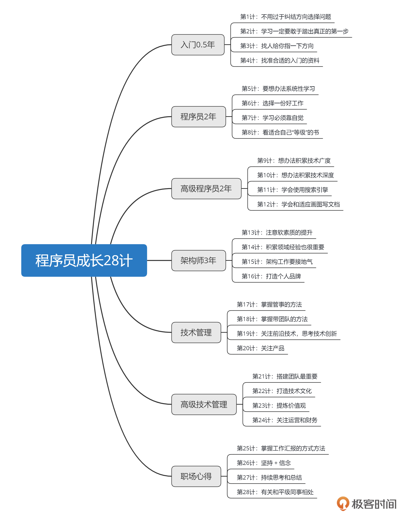

# 37 | 加餐7：程序员成长28计
你好，我是朱晔。

今天直播，我准备和你聊聊程序员成长的话题。我从毕业后入行到现在作为一个高级管理者，已经在互联网领域拼搏了15年了。我把这些年自己的成长历程、心得体会整理成了“程序员成长28计”。

今天，我就和你分别聊聊这28计。

## 入门 0.5年

**第1计**：不要过于纠结方向选择问题。

开始入门的时候，我们可能都会纠结于选择前端还是后端，选择了后端还犹豫到底选Java、Go还是Python。

其实，我觉得不用过于纠结。如果说你对偏前端的内容感兴趣，那就从前端入手；对数据库方面的内容感兴趣，那就从后端入手。等你真正入门以后，你再去转方向、转技术栈都会非常容易，因为技术都是相通的。

**第2计：** 学习一定要敢于踏出真正的第一步。

这里我说的第一步，不是说开始看某个领域的书了，而是真正把IDE下载好、把编程环境搭建好，并实现一个最简单的程序。我一直觉得，把编程环境搭建好，就已经算是入门一半了。

如果你只是停留在看书这个层次上的话，是永远入不了门的。因为这些知识只是停留在书上，还没有真正变成你自己的。只有自己写过、实践过，才能真正掌握。

**第3计：** 找人给你指一下方向。

刚入门的时候，面对各种各样的语言、技术你很可能会迷茫。就比如说，刚入门后端的时候，Spring全家桶有十几样，还有各种数据库方面的，Java程序本身的语法和框架，那到底先学什么呢？这个时候，只要找人给你指点一下学习的顺序，以及按照怎样的主线来学习，就会事半功倍。否则，你会在大量的资料里花费大量的时间、消耗大量的精力。

**第4计**：找准合适的入门资料。

在我看来，选择入门资料，需要注意两点：

1. 一定要选择手把手的资料，也就是从搭环境开始怎么一步步地去操作，并带一些实战项目。这样看，视频课程可能更合适。
2. 要难度合适。

那怎么理解“难度合适”呢？举个例子，你看的这本书的知识深度在70分，而你自己的知识深度在60分，那这本书非常合适。因为从60到65的感觉是非常爽的。在60分的时候，你有能力去汲取70分深度的书里面的知识点，然后你会变成65分。而如果你现在的知识深度在20分去看70分的书，或者你的知识深度在75分却去看70分的书，就不会有任何感觉、任何收益。所以，很多同学看我的专栏课程会有共鸣，也是这个原因。

## 程序员2年

**第5计**：想办法系统性地学习。

步入两年这个阶段后，我们要开始想办法系统性地学习了，比如系统性地学习设计模式、算法、数据库。只有系统性地学习，才能给我们建立起完整的知识框架。因为一定是先有知识网络，才能在网络上继续铺更多的东西。

那怎么才能有系统性学习的动力呢？

第一，分享可以让自己有动力。比如，你说要写一个什么系列的文章，那话说出去了，就会逼着自己去实现。

第二，花钱买课程，做系统性的学习。当你花了几百甚至几千块钱去买课程的时候，就会逼着自己的学习，不然钱就浪费掉了。

**第6计：** 选择一份好工作。

选择一份好工作，也就是选择一个好的项目，从而积累一些人脉资源，是非常重要的，可能要比技术成长更重要些。

比如说，你能够进入到一个相对较大的公司，它能带给你的最最主要的就是人脉资源，也就是你能够认识更多、更优秀的人。认识这些人，就是你日后的机会。

**第7计：** 学习必须靠自觉。

我们不能期望项目经验一定或者说一直会给自己带来技术提升。即使是你能接触一些高并发的、比较复杂的项目，它们带来的提升也是有限的，或者说持续的时间通常会比较短。

因为大多数公司在乎的都是你的输出，输出你的能力和经验。所以说，学习和成长这件事儿，必须靠自觉，包括自觉地去想如何系统性地学习、如何有计划地学习，以及平时要多问为什么。

**第8计：** 看适合自己的书。

这里也是说，我们在看书的过程中，要注意去鉴别书的层次，选择难度合适的书。

其实，在做程序员前两年的时间里，我不太建议去广泛地看书，要先想办法能够专注些，打好自己主要的编程语言的基础；然后，围绕着自己主要的编程语言或者主要使用的技术去看书。

**第9计：** 想办法积累技术广度。

将来踏上技术管理路线之后，你有可能管的团队不是你这个领域，比如你是后端出身可能要带领移动团队。如果你不知道移动端最基本的东西的话，是没有办法跟团队成员沟通的。所以说，你可以有自己的一个专长，但是你要知道其他领域最基本的东西。

积累技术广度的方式，主要有下面三种。

第一，体验全栈。如果你是做后端的，就应该去大概了解下客户端、移动端，或者说大前端；可以了解下测试和运维怎么做，了解运维的话帮助可能会更大。你还可以动手做一个自己的项目，就从云服务器的采购开始。在搭建项目部署的过程中，你可以自己去搭建运维相关的部分，甚至是自己搭建一些中间件。

因为在大厂，一般都有自动化发布系统、有工程化平台、有自己的运维体系、有自己的监控系统等等。但是，如果只是使用这些工具的话，我们是没法建立一个全局观的，因为我们不知道它们是怎么运作的。

第二，多学一些编程语言。但是学了几门编程语言后，你会发现每门语言都有自己的特色和软肋。这就会引发你很多的思考，比如为什么这个语言没有这个特性，又怎么样去解决。另外，每门语言他都有自己的技术栈，你会来回地比较。这些思考和比较，对自己的成长都很有用。

如果你对一个语言的掌握比较透彻的话，再去学其他语言不会花很久。我刚毕业是做.net，后来转了Java，再后来又去学Python。因为高级语言的特性基本上都差不多，你只要学一些语法，用到的时候再去查更多的内容，然后做个项目，所以学一门语言可能也就需要一个月甚至会更快一些。

第三，广泛看书。

**第10计：** 想办法积累技术深度。

主要的方式是造轮子、看源码和学底层。

第一，造轮子。所谓的造轮子，不一定是要造完要用，你可以拿造轮子来练手，比如徒手写一个框架。在这个过程中，你会遇到很多困难，然后可能会想办法去学习一些现有技术的源码，这对技术深度的理解是非常有帮助的。

第二，看一些源码。如果你能够理清楚一些源码的主线，然后你能积累很多设计模式的知识。

第三，学一些偏向于底层的东西，可以帮助你理解技术的本质。上层的技术都依赖于底层的技术，所以你学完了底层的技术后，就会发现上层的技术再变也没有什么本质上的区别，然后学起来就会非常快。

**第11计：** 学会使用搜索引擎。

对于程序员来说，最好可以使用Google来搜索，也就是说要使用英文的关键字来搜索。一方面，通过Google你可以搜到更多的内容，另一方面国外的技术圈或者网站关于纯技术的讨论会多一些。

**第12计：** 学会和适应画图、写文档。

我觉得，写文档是在锻炼自己的总结能力和表达能力，画图更多的是在锻炼自己的抽象能力。写文档、画架构图，不仅仅是架构师需要具备的能力，还是你准确表达自己观点的必备方式。所以，我们不要觉得，宁肯写100行代码，也不愿意写一句话。

## 架构师3年

**第13计：** 注意软素质的提升。

这时候你已经有了好几年的经验了，那除了技术方面，还要注意软素质，比如沟通、自我驱动、总结等能力的提升。比如说沟通能力，就是你能不能很流畅地表达自己的观点，能不能比较主动地去沟通。

这些素质在日常工作中还是挺重要的，因为你做了架构师之后，免不了要去跟业务方和技术团队，甚至是其他的团队的架构师去沟通。 如果你的这些软素质不过硬，那可能你的方案就得不到认可，没办法达成自己的目标。

**第14计：** 积累领域经验也很重要。

当你在一个领域工作几年之后，你就会对这个领域的产品非常熟悉，甚至比产品经理更懂产品。也就是说，即使这个产品没有别人的帮助，你也可以确保它朝着正确的方向发展。如果你想一直在这个领域工作的话，这种领域经验的积累就对自己的发展非常有帮助。

所以说，有些人做的是业务架构师，他可能在技术上并不是特别擅长，但对这个领域的系统设计或者说产品设计特别在行。如果说，你不想纯做技术的话，可以考虑积累更多的领域经验。

**第15计：** 架构工作要接地气。

我以前做架构师的时候发现，有些架构师给出的方案非常漂亮，但就是不接地气、很难去落地。所以，在我看来，架构工作必须要接地气，包括三个方面：产出符合实际情况的方案、方案要落地实际项目、不要太技术化。

这里其实会有一个矛盾点：如果你想要提升自己的经验、技术，很多时候就需要去引入一些新技术，但是这些新技术的引入需要成本。而这里的成本不仅仅是你自己学习的成本，还需要整个团队有一定的经验。

比如Kubernetes，不是你引入了团队用就完事儿，整个团队的技术都需要得到提升，才能够驾驭这个系统。如果我们是为了自己的利益去引入一些不太符合公司实际情况的技术的话，其实对公司来说是不负责任的，而且这个方案很大程度上有可能会失败。

所以说，我觉得做架构工作是要产出一些更接地气的方案。比如同样是解决一个问题，有些架构方式或设计比较“老土”，但往往是很稳定的；而一些复杂的技术，虽然有先进的理念和设计，但你要驾驭它就需要很多成本，而且因为它的“新”往往还会存在各种各样的问题。

这也就是说，我们在设计架构的时候，必须要权衡方案是否接地气。

**第16计：** 打造个人品牌。

我觉得，个人品牌包括口碑和影响力两个方面。

口碑就是你日常工作的态度，包括你的能力和沟通，会让人知道你靠不靠谱、能力是不是够强。好的口碑再加上宝贵的人脉，就是你非常重要的资源。口碑好的人基本上是不需要主动去找工作的，因为一直会有一些老领导或者朋友、同事会千方百计地想要给你机会。

很多人的技术非常不错，但就是没人知道他，问题就出在影响力上。而提升影响力的方法，无外乎就是参加技术大会、做分享、写博客、写书等等。

有了影响力和口碑，让更多的人能接触到你、认识你，你就会有更多的机会。

## 技术管理

**第17计：** 掌握管事的方法。

“管事”就是你怎样去安排，这里包括了制定项目管理流程、制定技术标准、工具化和自动化三个方面。

刚转做技术管理时容易犯的一个错的是，把事情都抓在自己手里。这时，你一定要想通，不是你自己在干活，你的产出是靠团队的。与其说什么事情都自己干，还不如说你去制定规范、流程和方向，然后让团队去做，否则你很容易就成了整个团队的瓶颈。

**第18计：** 掌握带团队的方法。

第一，招人&放权。带团队的话，最重要是招到优秀的人，然后就是放权。不要因为担心招到的人会比自己优秀，就想要找“弱”一些的。只有团队的事情做得更好了，你的整个团队的产出才是最高。

第二，工程师文化。通过建立工程师文化，让大家去互相交流、学习，从而建立一个良好的学习工作氛围。

第三，适当的沟通汇报制度。这也属于制定流程里面的，也是要建立一个沟通汇报的制度。

**第19计：** 关注前沿技术，思考技术创新。

做了技术管理之后，你的视角要更高。你团队的成员，可能只是看到、接触到这一个部分、这一个模块，没有更多的信息，也没办法想得更远。这时，你就必须去创新、去关注更多的前沿技术，去思考自己的项目能不能用上这些技术。

**第20计：** 关注产品。

在我看来，一个产品的形态很多时候决定了公司的命运，在产品上多想一些点子，往往要比技术上的重构带来的收益更大。这里不仅仅包括这个产品是怎么运作的，还包括产品中包含的创新、你能否挖掘一些衍生品。

## 高级技术管理

在这个层次上面，我们更高级的技术管理可能是总监级别甚至以上，我以前在两家百人以上的小公司做过CTO。我当时的感觉是，所做的事情不能仅限于产品技术本身了。

**第21计：** 搭建团队最重要。

这和招人还不太一样，招人肯定招的是下属，而搭建团队是必须让团队有一个梯队。一旦你把一些核心的人固化下来以后，整个团队就发展起来了。所以，你要在招人方面花费更多的精力，当然不仅仅是指面试。

搭建团队最重要的是你自己要有一个想法，知道自己需要一个什么样的职位来填补空缺，这个岗位上又需要什么样的人。

**第22计：** 打造技术文化。

虽然在做技术管理的时候，我强调说要建立制度，但文化会更高于制度，而且文化没有那么强势。因为制度其实是列出来，要求大家去遵守，有“强迫”的感觉；而文化更强调潜移默化，通过耳濡目染获得大同感。这样一来，大家慢慢地就不会觉得这是文化了，而是说我现在就是这么干事儿的。

**第23计：** 提炼价值观。

价值观是说公司按照这个理念去运作，希望有一些志同道合的人在一起干活。所以价值观又会高于文化，是整个公司层面的，对大家的影响也会更多。

虽然说价值观不会那么显性，但可以长久地确保公司里面的整个团队的心都是齐的，大家都知道公司是怎么运作的，有相同的目标。

**第24计：** 关注运营和财务。

到了高级技术管理的位置，你就不仅仅是一个打工的了，你的命运是和公司紧紧绑定在一起的。所以，你需要更多地关注公司的运营和财务。

当你觉得自己的团队很小却要做那么多项目的时候，可以站在更高的角度去换位思考下。这时你可能就发现，你的团队做的事情并没有那么重要，对整个公司的发展来说你的团队规模已经足够了。如果说我们再大量招人的话，那么财务上就会入不敷出，整个公司的情况肯定也不会好。

## 职场心得

**第25计：** 掌握工作汇报的方式方法。

首先，我们不要把汇报当作负担、当作浪费时间。汇报其实是双向的，你跟上级多沟通的话，他可以反馈给你更多的信息，这个信息可能是你工作的方向，也可能是给你的一些资源，还可能是告诉你上级想要什么。因为你和你的上级其实在一个信息层面上是不对等的，他能收到更上级的信息，比如公司策略方面的信息。

**第26计：** 坚持+信念。

第一，如果说你的目标就是成功的话，那没有什么可以阻挡你。职场上的扯皮和甩锅，都是避免不了的。举个例子吧。

我以前在一家公司工作的时候，别人不愿意配合我的工作。那怎么办呢，我知道自己的目标是把这件事儿做成。当时，这个项目的很多内容，比如说运维，都不在我这边，需要其他同事来负责。但人家就是不配合，群里艾特也不看，打电话也不接，那我怎么办呢？多打两次呗，实在不行我就发邮件抄送大家的上级。总之，就是想尽办法去沟通，因为你的目标就是成功。

第二，很多时候，创新就是相信一定可以实现才有的。

很多时候，你觉得这个事情是做不成的，然后直接拒绝掉了，创新就没有了。但如果相信这个事情一定是可以做成的，你就会想方设法去实现它，这个时候你想出来的东西就是有开创性的，就是创新。

**第27计：** 持续的思考和总结。

在职场上提炼方法论是非常重要的。你要去思考自己在工作中对各种各样的事情的处理，是不是妥当，是不是能够总结出一些方法论。把这些方法论提炼保留下来，将来是能够帮到你的。很多东西，比如复盘自己的工作经历、复盘自己的选择，都要动脑子、都要去写，不能说过去了就过去了。这些经历提炼出的方法论，都是你的经验，是非常有价值的。

**第28计：** 有关和平级同事的相处。

和平级同事之间，要以帮助别人的心态来合作。我们和上下级的同事来沟通，一般是不会有什么问题的，但跟平级的，尤其是跨部门的平级同事去沟通的时候，往往会因为利益问题，不会很愉快。

我觉得，这里最重要的就是以帮助别人的心态来合作。 比如这样说“你有什么困难的话，可以来问我”“你人手是不是不够，我可以帮你一起把这个项目做好”。这样大家的合作会比较顺畅，别人也不会有那么多戒心。

人和人的沟通，还在于有一层纱，突破了这层纱以后，大家就都会相信你，觉得你是一个靠谱的人。这样，平级同事也会愿意和你分享一些东西，因为他放心。

## 管理格言

接下来，我要推荐的8条管理格言，是曹操管理和用人的理念，不是我自己总结出来的。

第一，真心诚意，以情感人。人和人之间去沟通的时候，不管是和上级或者下级的沟通，都要以非常诚恳的态度去沟通。

第二，推心置腹，以诚待人。有事情不要藏在心里，做“城府很深”的管理者。我觉得更好的方式是，让大家尽可能地知道更多的事儿，统一战线，站在一个角度来考虑问题。

第三，开诚布公，以理服人。把管理策略公布出来，不管是奖励也好惩罚也罢，让团队成员感觉公平公正，

第四，言行一致，以信取人。说到做到，对于管理下属、和别人沟通都非常重要。

第五，令行禁止，依法治人。管理上，你要制定好相关的制度，而且要公开出来。如果触犯了制度就需要惩罚，做得好了就要有奖赏。

第六，设身处地，以宽容人。很多时候，我们和别人的矛盾是没有足够的换位思考，没有设身处地地去想。如果说你的下属犯了错，还是要想一想是不是多给些机会，是不是能宽容一些。

第七，扬人责己，以功归人。这是非常重要的一点。事情是团队一起做的话，那就是团队的功劳，甚至下属的功劳。如果别人做得好的话，就要多表扬一些。对自己要严格一些，很多时候团队的问题就是管理者的问题，跟下属没太多关系。

第八，论功行赏，以奖励人。做得好了，要多给别人一些奖励。这也是公平公正的，大家都能看得到。

最后，我将关于程序员成长的28计整理在了一张思维导图上，以方便你收藏、转发。

我是朱晔，欢迎在评论区与我留言分享你的想法，也欢迎你把今天的内容分享给你的朋友或同事，一起交流。